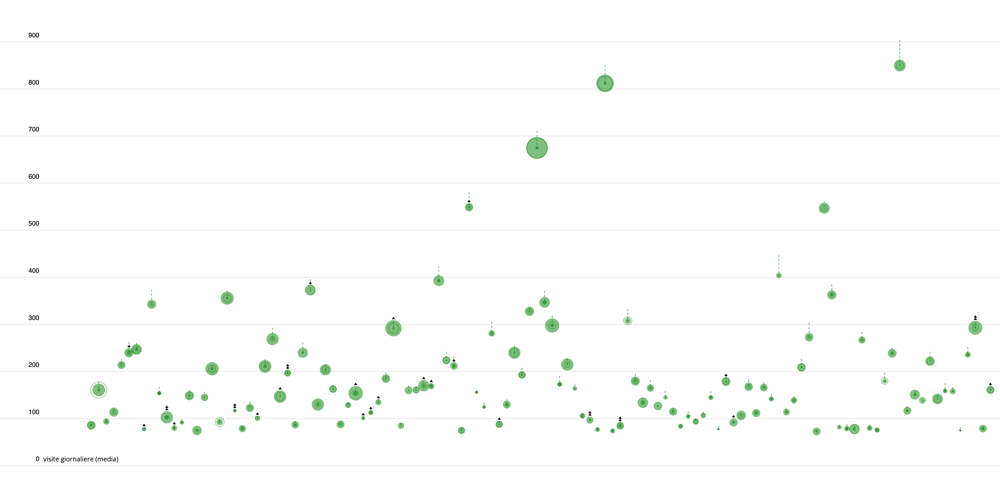

SUPSI 2024-25  
Data Visualization course, M-D3202E  
Teacher Giovanni Profeta


# Project title
Authors: [Iris Johanna Di Bello](https://www.instagram.com/irisdbl/), [Federica Eoli](https://www.instagram.com/federicaaaeoli/), [Gioia Le Le Wu](https://www.instagram.com/wu_gioia/)

[Plastic is Conquering the Oceans](https://irisdb22.github.io/plastic_is_conquering_the_oceans/)


## Abstract
This webpage shows the results of the research we carried out about one of the major problems related to pollution on Earth, that is the issue of plastics in the oceans. We chose this topic because, sadly, all of the plastic in the ocean is <em>made by humans.<\em>


## Introduction
Dolor sit amet consectetur adipiscing elit duis tristique. Sociis natoque penatibus et magnis dis parturient montes nascetur. Est sit amet facilisis magna. Tellus rutrum tellus pellentesque eu. Dictum sit amet justo donec enim. Aliquam malesuada bibendum arcu vitae elementum curabitur vitae. Sed faucibus turpis in eu mi bibendum neque egestas congue. Tellus in metus vulputate eu scelerisque felis imperdiet proin. Dolor magna eget est lorem ipsum dolor. Sit amet mattis vulputate enim nulla. Elit pellentesque habitant morbi tristique senectus et. Vestibulum mattis ullamcorper velit sed ullamcorper morbi tincidunt ornare massa.


## Data sources
Facilisis magna etiam tempor orci eu. Felis donec et odio pellentesque diam volutpat commodo. Dis parturient montes nascetur ridiculus mus mauris vitae. Nisi vitae suscipit tellus mauris a diam maecenas sed enim. Accumsan sit amet nulla facilisi. Ultricies leo integer malesuada nunc vel risus. Est lorem ipsum dolor sit. Ultrices neque ornare aenean euismod elementum nisi. Ultrices mi tempus imperdiet nulla malesuada pellentesque elit eget gravida. Placerat duis ultricies lacus sed turpis tincidunt id aliquet. Arcu dictum varius duis at consectetur lorem donec massa sapien. Pellentesque habitant morbi tristique senectus. Turpis massa sed elementum tempus egestas sed sed risus pretium. Eros donec ac odio tempor orci. Pellentesque id nibh tortor id aliquet lectus. Risus feugiat in ante metus dictum at. Quam pellentesque nec nam aliquam sem et tortor consequat id. Feugiat nibh sed pulvinar proin gravida hendrerit lectus a. Sit amet dictum sit amet justo donec enim.

[Datasource 1](https://figshare.com/articles/dataset/Plastic_Marine_Pollution_Global_Dataset/1015289?file=1483767)
[Datasource 2](https://ourworldindata.org/grapher/plastic-waste-emitted-to-the-ocean)
[Datasource 3.1](https://ourworldindata.org/grapher/plastic-waste-mismanaged)
[Datasource 3.2](https://ourworldindata.org/grapher/mismanaged-plastic-waste-per-capita)

## Data pre-processing
Nunc consequat interdum varius sit amet mattis vulputate. Vehicula ipsum a arcu cursus vitae congue. Odio ut sem nulla pharetra. Accumsan lacus vel facilisis volutpat est velit egestas dui id. Quisque egestas diam in arcu cursus. Eget nulla facilisi etiam dignissim diam. Aenean sed adipiscing diam donec adipiscing tristique. Porttitor massa id neque aliquam. Sem viverra aliquet eget sit amet tellus cras. Scelerisque eu ultrices vitae auctor eu augue ut lectus. Nunc aliquet bibendum enim facilisis gravida neque convallis a. Lacus sed turpis tincidunt id aliquet risus feugiat.


```Python
import pandas as pd

df = pd.read_csv('file.tsv', sep='\t')
print(df.columns)
```

## Data visualizations
Sed enim ut sem viverra aliquet eget sit. Iaculis at erat pellentesque adipiscing commodo. Et pharetra pharetra massa massa ultricies mi quis hendrerit dolor. At tempor commodo ullamcorper a lacus vestibulum sed arcu. Ipsum faucibus vitae aliquet nec ullamcorper sit. Tempus quam pellentesque nec nam aliquam sem et tortor. Turpis egestas sed tempus urna et pharetra pharetra massa. Ridiculus mus mauris vitae ultricies leo integer malesuada nunc vel.

### Title of the data visualization n. 1 
Accumsan lacus vel facilisis volutpat est velit egestas dui id. Quisque egestas diam in arcu cursus. Eget nulla facilisi etiam dignissim diam. Aenean sed adipiscing diam donec adipiscing tristique. Porttitor massa id neque aliquam. Sem viverra aliquet eget sit amet tellus cras. Scelerisque eu ultrices vitae auctor eu augue ut lectus.

[]()

### Title of the data visualization n. 2
Accumsan lacus vel facilisis volutpat est velit egestas dui id. Quisque egestas diam in arcu cursus. Eget nulla facilisi etiam dignissim diam. Aenean sed adipiscing diam donec adipiscing tristique. Porttitor massa id neque aliquam. Sem viverra aliquet eget sit amet tellus cras. Scelerisque eu ultrices vitae auctor eu augue ut lectus.

[]()


## Key findings
Accumsan lacus vel facilisis volutpat est velit egestas dui id. Quisque egestas diam in arcu cursus. Eget nulla facilisi etiam dignissim diam. Aenean sed adipiscing diam donec adipiscing tristique. Porttitor massa id neque aliquam. Sem viverra aliquet eget sit amet tellus cras. Scelerisque eu ultrices vitae auctor eu augue ut lectus. Nunc aliquet bibendum enim facilisis gravida neque convallis a. Lacus sed turpis tincidunt id aliquet risus feugiat.

## Next steps
Tellus rutrum tellus pellentesque eu. Dictum sit amet justo donec enim. Aliquam malesuada bibendum arcu vitae elementum curabitur vitae. Sed faucibus turpis in eu mi bibendum neque egestas congue. Tellus in metus vulputate eu scelerisque felis imperdiet proin. Dolor magna eget est lorem ipsum dolor. Sit amet mattis vulputate enim nulla. Elit pellentesque habitant morbi tristique senectus et.