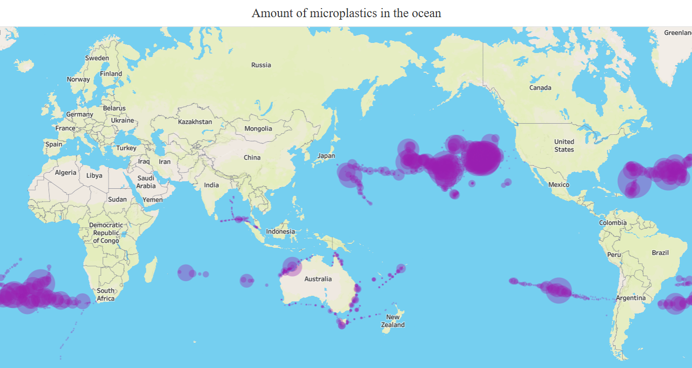

SUPSI 2024-25  
Data Visualization course, M-D3202E  
Teacher Giovanni Profeta

# Plastic is Conquering the Oceans
Authors: [Iris Johanna Di Bello](https://www.instagram.com/irisdbl/), [Federica Eoli](https://www.instagram.com/federicaaaeoli/), [Gioia Le Le Wu](https://www.instagram.com/wu_gioia/)

[Plastic is Conquering the Oceans](https://irisdb22.github.io/plastic_is_conquering_the_oceans/)

## Abstract
This webpage shows the results of the research we carried out about one of the major problems related to pollution on Earth, that is the issue of plastics in the oceans. We chose this topic because, sadly, all of the plastic in the ocean is <em>made by humans.</em>
The questions that we asked ourselves are, first of all, how much plastic is there in the oceans? Then we gathered some information on the consequences of these high quantities: we described what garbage patches are and their impact on human health and on the environment.
Subsequently, the main thing we wanted to discover was the source of all this pollution in the different oceans, and in particular which countries were the worst at managing plastic waste.
Lastly, to better explain this, we grouped the countries by continent and analyzed not just the total values, but also the values per capita, so the singular contribute to the issue. In fact, our final goal is to make everyone aware that the total amount of global waste is made by the contribute of every single person on this planet, and that the change is always in the hands of the collectivity, which, however, is made by many individuals.

## Introduction
Do you know which is one of the biggest things made by humans? Well, it's easy. It is <em>waste</em>. Humans are really good at creating waste, but, unfortunately, they're not equally good at disposing it. In this webpage we analyze one of the most popular destinations of mismanaged waste: the ocean. How can we blame it? The ocean is definitely a good destination to choose. However, this choice can have serious consequences on our planet and its inhabitants, starting from the health of animals, of the environment and, last but not least, of humans.
Therefore, the target of this research is basically everyone. In fact, it's important that every human on this planet learns how much their habits could badly affect our environment. More in particular, we would like to draw the attention of the youngest generations, that are the ones that can really make a difference on the long term.

## Data sources

For the first data visualization, "Microplastic in the ocean", we used a dataset from Figshare that provides information about specific points in the ocean, including the latitude and longitude of each point and the corresponding amount of microplastic detected at that location.

For the second data visualization, titled "Countries that emit more plastic in the oceans," we used a dataset from Our World in Data, which provides the annual estimate of plastic emissions per country.

Lastly, for the third visualization, we used two datasets from Our World in Data: one for the total amount of mismanaged plastic waste and the other for the mismanaged plastic waste per capita. 

[Datasource 1](https://figshare.com/articles/dataset/Plastic_Marine_Pollution_Global_Dataset/1015289?file=1483767)
[Datasource 2](https://ourworldindata.org/grapher/plastic-waste-emitted-to-the-ocean)
[Datasource 3.1](https://ourworldindata.org/grapher/plastic-waste-mismanaged)
[Datasource 3.2](https://ourworldindata.org/grapher/mismanaged-plastic-waste-per-capita)

## Data pre-processing

1. The dataset “Plastic Marine Pollution Global Dataset” from Figshare was used to analyze the distribution of plastic waste in the oceans. It provided latitude and longitude information, indicating the exact locations of microplastics in the ocean. Furthermore, the dataset categorized microplastics into four size classes (measured in millimeters).
To enhance the analysis, we summed the quantities of microplastics for each size class and for each specific location. This allowed us to calculate the total quantity of microplastics in a km², giving a more comprehensive view of the density of microplastics across the ocean.
To do so, we created the column "SOMMA", that contained the final total amounts.

2. For the second data visualization we used the dataset about "Plastic emitted to the ocean" by Our World in Data, which provided the annual estimate of emissions of plastic in the oceans per country. The only pre-processing we did for this dataset was making sure that it contained the same countries as the dataset that we used for the third data visualization. Then, on Tableau, we decided to group the countries into five different categories, based on the amount of plastic that they emitted to the ocean, and in particular on this five ranges: 0-100, 100-1000, 1000-10.000, 10.000-100.000, >100.000 (tons of plastic).

3. For this last data visualization we used two datasets from Our World in Data about "Mismanaged Plastic Waste". The first one focused about the total amount of annual estimate of plastic emission per country, while the second one contained the per capita values.
The first step was organizing the countries into geographic macro-areas corresponding to continents. The continents considered for the analysis were:

•	South America and Central America
 •	North America
 •	South Africa
 •	North Africa
 •	Asia
 •	Europe
 •	Oceania

The datasets already contained some rows with the total values for some continents, but we deleted them to group the countries into those different macro-areas and to avoid that those values distorted the overall analysis.

Once the countries were grouped into their respective continent, we calculated the average plastic waste for each continent. We did so by summing the values of each country within every macro-area and dividing by the number of countries in that macro-area.

Then, to make a good comparison, we had to convert the values of the per capita dataset from kg to tons. 
   

## Data visualizations
Our analysis has revealed some key insights that shed light on the global issue of microplastics and poorly managed plastic waste.

### Data visualization n. 1 - Amount of microplastics in the ocean
The first visualization shows that the Pacific Ocean has the highest concentration of microplastics. This makes sense, if we consider its location: the Pacific lies between Asia and the Americas, two regions responsible for the largest amounts of plastic production and waste. As a result, vast amounts of plastic end up accumulating there. In comparison, the plastic islands in other oceans are relatively smaller.

### Data visualization n. 2 - Countries that emit more plastic in the oceans
The second visualization shows us which countries have the largest amount of plastic emitted in the oceans. It highlights that Asia, in particular, has a significant share of plastic that isn’t properly disposed of, contributing heavily to pollution.

### Data visualization n. 3 - mismanaged waste - total VS per capita
Interestingly, the third visualization gives us a different perspective. When looking at per capita plastic consumption, North America stands out as the highest consumer. This means that while North America may not produce the largest total volume of mismanaged plastic, individual consumption levels are the highest in the world.

## Key findings
Our research revealed that the countries contributing most significantly to ocean pollution are primarily located in Asia and North America. This finding aligns with the fact that the largest plastic garbage patch is in the Pacific Ocean, underscoring the regional sources of the problem. At the same time, our analysis confirmed that global waste generation is ultimately the result of individual contributions from every person on the planet. This highlights the critical importance of individual actions and behaviors in addressing the issue. To create meaningful change, it is essential to focus on these individual contributions as the foundation for larger, collective efforts.

## Next steps
To build on these findings, we suggest two main steps:
1.	Instead of grouping data by continents, we could conduct a more detailed analysis by examining plastic consumption and waste management at the country level, including per capita consumption. This approach would provide a clearer understanding of where the issue is most critical and the underlying reasons. Additionally, for each country, we could assess their performance in recycling and other waste disposal methods to identify specific areas for improvement.
2.	We also would like to explore which types of plastic are most commonly found in the plastic islands and investigate the root causes of poor plastic management—whether they’re driven by political, economic, or social factors.
These deeper insights would not only help us develop more targeted solutions but also raise awareness and encourage action among policymakers and communities worldwide to effectively address the plastic crisis.
